# BẢN THUYẾT MINH CHI TIẾT CÁC HỢP PHẦN
## Cổng Pháp luật Quốc gia

*Tài liệu mô tả tổng quan sáu hợp phần nghiệp vụ trọng tâm của Cổng Pháp luật Quốc gia, phục vụ công tác giới thiệu, thẩm định và triển khai. Mỗi hợp phần được trình bày theo một khung thống nhất: màn hình đại diện, tên hợp phần, mục tiêu, mô tả, đối tượng sử dụng, điểm nổi bật và luồng quy trình tổng quan.*

> **Ghi chú về màn hình đại diện:** Mỗi hợp phần kèm theo một ảnh màn hình mẫu. Tệp ảnh được đặt trong thư mục `documents/images/`. Nếu ảnh chưa được chèn, hãy chụp màn hình tại đường dẫn được nêu ngay dưới mỗi hình và lưu đúng tên tệp tương ứng.

---

## 1. Hợp phần Đa phương tiện

**Màn hình đại diện**

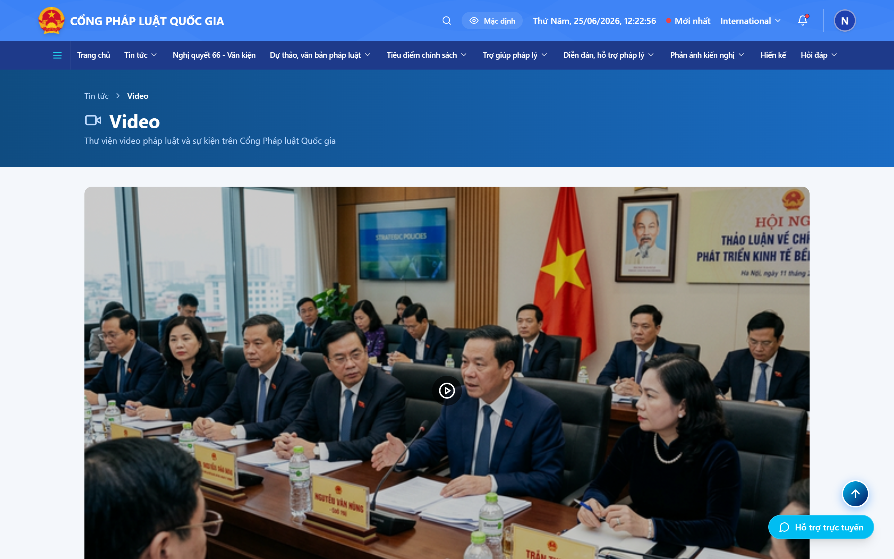

*Hình 1. Màn hình Thư viện đa phương tiện — Thư viện video (đường dẫn `/video`), Thư viện hình ảnh (`/anh`) và Đồ họa thông tin (`/infographic`).*

### 1.1. Tên hợp phần
Hợp phần Đa phương tiện (thư viện video, hình ảnh và đồ họa thông tin).

### 1.2. Mục tiêu của hợp phần
Truyền tải thông tin, kiến thức pháp luật một cách trực quan, sinh động thông qua video, hình ảnh và đồ họa thông tin; qua đó nâng cao khả năng tiếp cận, mức độ ghi nhớ và sức lan tỏa của nội dung pháp luật tới đông đảo người dân.

### 1.3. Mô tả về hợp phần
Hợp phần tập hợp và trình bày các nội dung pháp luật dưới dạng đa phương tiện, gồm ba nhóm chính: thư viện video, thư viện hình ảnh và đồ họa thông tin. Người dùng có thể tìm kiếm theo từ khóa, lọc theo chủ đề, xem danh sách và mở chi tiết từng nội dung. Đối với video, hệ thống cung cấp trình phát hỗ trợ phát và tạm dừng, tua nhanh hoặc lùi, bật hoặc tắt phụ đề, lựa chọn chất lượng hiển thị và gợi ý các video liên quan. Đối với hình ảnh và đồ họa thông tin, người dùng có thể phóng to, thu nhỏ, xem toàn màn hình, tải về hoặc chia sẻ. Hợp phần cũng cho phép bình luận và báo cáo vi phạm đối với nội dung không phù hợp.

### 1.4. Đối tượng sử dụng hướng đến
Người dân, doanh nghiệp, học sinh – sinh viên, đội ngũ làm công tác phổ biến, giáo dục pháp luật và cơ quan báo chí, truyền thông.

### 1.5. Điểm nổi bật của hợp phần
- Nội dung pháp luật được thể hiện trực quan, dễ hiểu, dễ tiếp nhận.
- Trình phát video đầy đủ tiện ích, kèm phụ đề và lựa chọn chất lượng.
- Cho phép phóng to, tải về và chia sẻ nhanh hình ảnh, đồ họa thông tin.
- Tự động gợi ý các nội dung liên quan để người dùng tham khảo thêm.
- Có cơ chế bình luận và báo cáo vi phạm nhằm bảo đảm môi trường nội dung lành mạnh.

### 1.6. Luồng quy trình tổng quan
1. Người dùng truy cập thư viện đa phương tiện (video, hình ảnh hoặc đồ họa thông tin).
2. Tìm kiếm theo từ khóa hoặc lọc theo chủ đề để thu hẹp danh sách.
3. Chọn một nội dung để mở màn hình chi tiết.
4. Xem nội dung: phát video, phóng to hình ảnh hoặc xem đồ họa thông tin toàn màn hình.
5. Tải về, chia sẻ, bình luận hoặc xem tiếp nội dung liên quan được gợi ý.

**Sơ đồ swimlane luồng quy trình:**

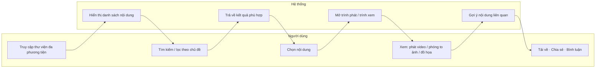

---

## 2. Hợp phần Dự thảo văn bản

**Màn hình đại diện**

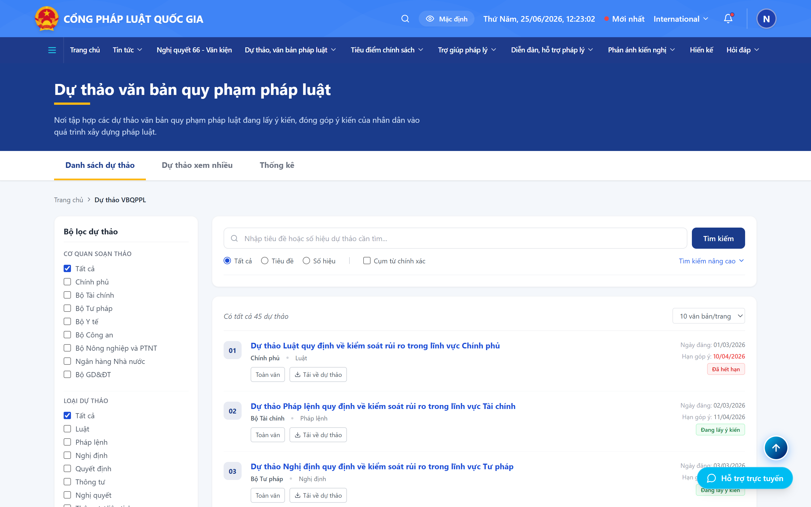

*Hình 2. Màn hình Dự thảo văn bản — Danh sách dự thảo đang lấy ý kiến (`/du-thao`) và màn hình toàn văn dự thảo kèm khung góp ý (`/du-thao/:id`).*

### 2.1. Tên hợp phần
Hợp phần Dự thảo văn bản quy phạm pháp luật.

### 2.2. Mục tiêu của hợp phần
Công khai, minh bạch các dự thảo văn bản đang trong quá trình xây dựng; đồng thời thiết lập kênh để người dân, doanh nghiệp và các tổ chức tham gia góp ý, đóng góp trực tiếp vào quá trình hoàn thiện chính sách, pháp luật.

### 2.3. Mô tả về hợp phần
Hợp phần hiển thị danh sách các dự thảo đang lấy ý kiến, có phân trang và bộ lọc, hỗ trợ tìm kiếm theo tên dự thảo (tìm kiếm đơn giản) và theo nhiều tiêu chí kết hợp (tìm kiếm nâng cao). Mỗi dự thảo có màn hình chi tiết hiển thị toàn văn (cho phép phóng to, thu nhỏ, tải bản tài liệu), kèm các thông tin mô tả như mục tiêu xây dựng, phạm vi điều chỉnh và đối tượng tác động. Người dùng có thể xem danh sách tài liệu đính kèm, các văn bản liên quan và dòng thời gian tiến độ xây dựng dự thảo. Quan trọng nhất, hợp phần cho phép gửi góp ý trực tuyến, xem lại danh sách ý kiến đã gửi và theo dõi báo cáo tiếp thu, giải trình.

### 2.4. Đối tượng sử dụng hướng đến
Người dân, doanh nghiệp, chuyên gia pháp lý, hiệp hội, tổ chức xã hội – nghề nghiệp và các cơ quan có liên quan đến quá trình xây dựng pháp luật.

### 2.5. Điểm nổi bật của hợp phần
- Công khai toàn văn dự thảo cùng các thông tin mô tả đầy đủ, rõ ràng.
- Cho phép góp ý trực tuyến thuận tiện, không cần thủ tục giấy tờ.
- Trình bày tiến độ xây dựng dự thảo theo dòng thời gian trực quan.
- Tập hợp đầy đủ tài liệu đính kèm và văn bản liên quan để đối chiếu.
- Cho phép theo dõi việc tiếp thu, phản hồi đối với ý kiến đã gửi.

### 2.6. Luồng quy trình tổng quan
1. Người dùng xem danh sách dự thảo đang lấy ý kiến hoặc tìm kiếm dự thảo quan tâm.
2. Mở dự thảo để đọc toàn văn cùng các tài liệu đính kèm và thông tin mô tả.
3. Soạn và gửi ý kiến góp ý trực tuyến.
4. Theo dõi danh sách ý kiến đã gửi và tiến độ xây dựng dự thảo.
5. Xem báo cáo tiếp thu, giải trình của cơ quan chủ trì soạn thảo.

**Sơ đồ swimlane luồng quy trình:**

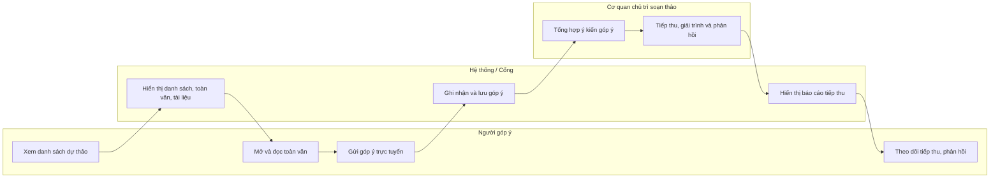

---

## 3. Hợp phần Quản lý thông tin cá nhân hóa

**Màn hình đại diện**

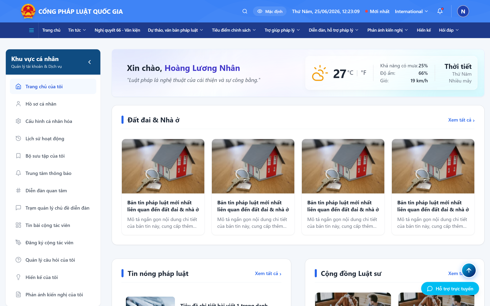

*Hình 3. Màn hình Quản lý thông tin cá nhân hóa — Trang chủ cá nhân và bảng điều khiển người dùng (`/ca-nhan/trang-chu`), kèm Bộ sưu tập và Trung tâm thông báo.*

### 3.1. Tên hợp phần
Hợp phần Quản lý thông tin cá nhân hóa.

### 3.2. Mục tiêu của hợp phần
Mang lại trải nghiệm được cá nhân hóa cho từng người dùng; giúp người dân, doanh nghiệp quản lý hồ sơ, lưu trữ nội dung quan tâm, nhận thông tin pháp luật đúng nhu cầu và chủ động kiểm soát các thông báo.

### 3.3. Mô tả về hợp phần
Người dùng đăng nhập vào Cổng bằng tài khoản định danh điện tử (VNeID) và được xác thực an toàn. Sau khi đăng nhập, người dùng quản lý hồ sơ cá nhân hoặc doanh nghiệp, thiết lập các lĩnh vực pháp luật quan tâm và sắp xếp thứ tự ưu tiên để hệ thống cá nhân hóa nội dung hiển thị. Hợp phần cho phép tạo và quản lý bộ sưu tập (văn bản, tin bài, nội dung tư vấn đã lưu), xem lại lịch sử hoạt động, quản lý danh sách tin bài yêu thích và danh sách bình luận của bản thân. Trên cơ sở hành vi sử dụng, hệ thống đề xuất văn bản và tin tức liên quan. Hợp phần cũng cung cấp trung tâm thông báo cùng các tùy chọn cấu hình theo loại thông báo, lĩnh vực, kênh nhận, tần suất và khung giờ. Ngoài ra, người dùng có thể đăng ký làm cộng tác viên để tham gia biên tập, gửi duyệt tin bài theo phân quyền.

### 3.4. Đối tượng sử dụng hướng đến
Người dân và doanh nghiệp đã đăng nhập; cộng tác viên tham gia biên tập nội dung.

### 3.5. Điểm nổi bật của hợp phần
- Đăng nhập và xác thực an toàn qua tài khoản định danh điện tử (VNeID).
- Cá nhân hóa nội dung hiển thị theo lĩnh vực quan tâm và hành vi sử dụng.
- Tạo bộ sưu tập riêng để lưu trữ và sắp xếp nội dung pháp luật.
- Trung tâm thông báo cho phép cấu hình linh hoạt theo nhu cầu.
- Hỗ trợ cộng tác viên tham gia biên tập, gửi duyệt tin bài.

### 3.6. Luồng quy trình tổng quan
1. Người dùng đăng nhập bằng tài khoản định danh điện tử.
2. Hoàn thiện hồ sơ và lựa chọn các lĩnh vực pháp luật quan tâm.
3. Hệ thống cá nhân hóa nội dung trang chủ và các đề xuất hiển thị.
4. Người dùng lưu nội dung vào bộ sưu tập, theo dõi chủ đề và nhận thông báo phù hợp.
5. Quản lý hồ sơ, lịch sử, bình luận và cấu hình thông báo theo nhu cầu.

**Sơ đồ swimlane luồng quy trình:**

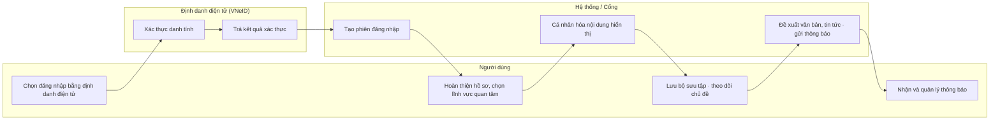

---

## 4. Hợp phần Hỏi đáp và tư vấn pháp luật

**Màn hình đại diện**

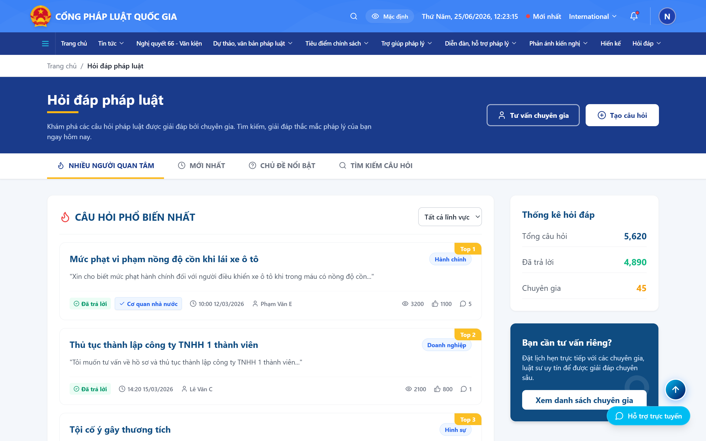

*Hình 4. Màn hình Hỏi đáp và tư vấn pháp luật — Danh sách câu hỏi (`/cau-hoi-phap-luat`), Danh sách chuyên gia (`/cau-hoi-phap-luat/chuyen-gia`) và tư vấn trực tuyến.*

### 4.1. Tên hợp phần
Hợp phần Hỏi đáp và tư vấn pháp luật.

### 4.2. Mục tiêu của hợp phần
Giải đáp kịp thời các vướng mắc pháp lý của người dân, doanh nghiệp; kết nối người dân với đội ngũ chuyên gia, luật sư; góp phần nâng cao hiểu biết và niềm tin vào pháp luật.

### 4.3. Mô tả về hợp phần
Hợp phần cung cấp ngân hàng câu hỏi pháp luật, gồm danh sách câu hỏi được nhiều người quan tâm và câu hỏi mới, có hỗ trợ lọc theo lĩnh vực và tìm kiếm câu hỏi tương tự. Người dùng có thể đặt câu hỏi, lựa chọn lĩnh vực, đính kèm tài liệu; hệ thống tiếp nhận và chuyển tới chuyên gia xử lý. Khi có kết quả, người dùng xem nội dung trả lời, đánh giá mức độ hữu ích, chia sẻ và theo dõi danh sách câu hỏi của riêng mình. Bên cạnh hình thức hỏi đáp, hợp phần cho phép xem danh sách chuyên gia, đặt lịch tư vấn và tham gia tư vấn trực tuyến qua khung trò chuyện: gửi và nhận tin nhắn, xem trạng thái trực tuyến của tư vấn viên, điền biểu mẫu thông tin trước phiên, đánh giá chất lượng hỗ trợ và kết thúc phiên. Hệ thống còn hỗ trợ trả lời tự động qua trợ lý ảo nhằm giải đáp nhanh các câu hỏi thường gặp.

### 4.4. Đối tượng sử dụng hướng đến
Người dân và doanh nghiệp có nhu cầu được giải đáp pháp luật; đội ngũ chuyên gia, luật sư, tư vấn viên thực hiện trả lời và tư vấn.

### 4.5. Điểm nổi bật của hợp phần
- Ngân hàng câu hỏi phong phú, tìm kiếm và gợi ý câu hỏi tương tự.
- Kết nối trực tiếp với chuyên gia, luật sư cùng chức năng đặt lịch tư vấn.
- Tư vấn trực tuyến qua khung trò chuyện theo thời gian thực.
- Trợ lý ảo trả lời tự động đối với câu hỏi thường gặp.
- Cho phép đánh giá chất lượng để cải tiến dịch vụ tư vấn.

### 4.6. Luồng quy trình tổng quan
1. Người dùng tìm câu hỏi tương tự hoặc đặt câu hỏi mới, chọn lĩnh vực và đính kèm tài liệu.
2. Hệ thống tiếp nhận và chuyển câu hỏi tới chuyên gia phù hợp.
3. Chuyên gia trả lời; người dùng xem kết quả, đánh giá hữu ích và chia sẻ.
4. Trường hợp cần trao đổi sâu, người dùng chọn chuyên gia để đặt lịch hoặc tư vấn trực tuyến.
5. Kết thúc phiên tư vấn, người dùng đánh giá chất lượng hỗ trợ.

**Sơ đồ swimlane luồng quy trình:**

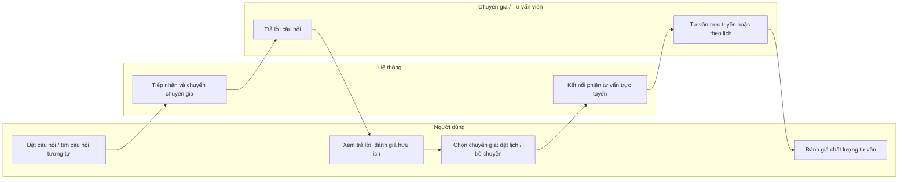

---

## 5. Hợp phần Hiến kế

**Màn hình đại diện**

*Hình 5. Màn hình Hiến kế — Trang chủ chuyên mục Hiến kế (`/hien-ke`) với các mục “Hiến kế của bạn”, “Chúng tôi cần bạn” và “Có thể bạn quan tâm”; kèm trang Quy trình xử lý (`/hien-ke/quy-trinh`).*

### 5.1. Tên hợp phần
Hợp phần Hiến kế (đóng góp sáng kiến xây dựng và thi hành pháp luật).

### 5.2. Mục tiêu của hợp phần
Thiết lập kênh huy động trí tuệ của xã hội, người dân và doanh nghiệp đóng góp sáng kiến, giải pháp cho công tác xây dựng và thi hành pháp luật; bảo đảm việc tiếp nhận, xử lý và phản hồi được thực hiện công khai, minh bạch.

### 5.3. Mô tả về hợp phần
Hợp phần được tổ chức thành ba mục chính. Mục “Hiến kế của bạn” cho phép người dân, doanh nghiệp đăng nhập, soạn nội dung hiến kế, chọn lĩnh vực, đính kèm tài liệu và gửi lên hệ thống. Mục “Chúng tôi cần bạn” đăng tải các chủ đề mà cơ quan nhà nước chủ động lấy ý kiến thông qua phiếu khảo sát. Mục “Có thể bạn quan tâm” trình bày các hiến kế theo từng lĩnh vực cụ thể. Bên cạnh đó, hợp phần giới thiệu các hiến kế tiêu biểu, công khai quy trình tiếp nhận và xử lý, cho phép người gửi theo dõi tình trạng và xem nội dung phản hồi chính thức. Nội dung hiến kế sau khi được thẩm định sẽ được công khai rộng rãi hoặc lưu trữ nội bộ tùy theo quyết định của cơ quan có thẩm quyền.

### 5.4. Đối tượng sử dụng hướng đến
Người dân và doanh nghiệp gửi hiến kế; quản trị viên mục Hiến kế thực hiện tiếp nhận, phân loại; đại diện các bộ, ngành thực hiện thẩm định và phản hồi.

### 5.5. Điểm nổi bật của hợp phần
- Tổ chức rõ ràng theo ba mục, thuận tiện cho việc đóng góp và theo dõi.
- Quy trình tiếp nhận, xử lý và phản hồi được công khai, minh bạch.
- Hiến kế được thẩm định bởi đúng bộ, ngành có thẩm quyền chuyên môn.
- Người gửi theo dõi được tình trạng và nhận phản hồi chính thức.
- Công khai các hiến kế tiêu biểu, tạo động lực tham gia của cộng đồng.

### 5.6. Luồng quy trình tổng quan
1. Người dân, doanh nghiệp đăng nhập và gửi hiến kế kèm tài liệu liên quan.
2. Hệ thống xác nhận đã tiếp nhận và tạo bản ghi theo dõi.
3. Quản trị viên mục Hiến kế kiểm tra, phân loại và chuyển tới bộ, ngành liên quan.
4. Đại diện bộ, ngành thẩm định nội dung và soạn nội dung phản hồi.
5. Quản trị viên thiết lập hiển thị: công khai rộng rãi hoặc lưu trữ nội bộ.
6. Người gửi theo dõi tình trạng và xem nội dung phản hồi chính thức.

**Sơ đồ swimlane luồng quy trình:**

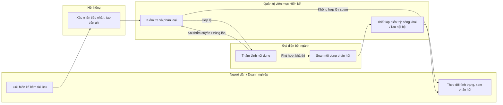

---

## 6. Hợp phần Các chuyên trang về hỗ trợ pháp luật

**Màn hình đại diện**

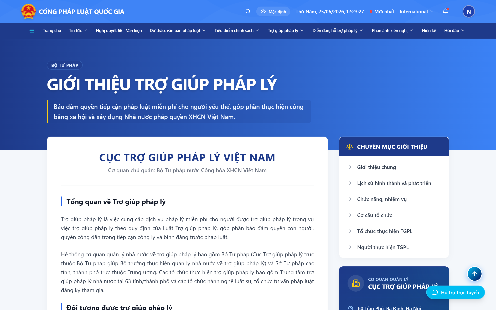

*Hình 6. Màn hình Các chuyên trang hỗ trợ pháp luật — Trợ giúp pháp lý (`/tro-giup-phap-ly`), Phổ biến, giáo dục pháp luật (`/pho-bien-giao-duc`) và Hỗ trợ pháp lý doanh nghiệp (`/ho-tro-phap-ly-doanh-nghiep`).*

### 6.1. Tên hợp phần
Hợp phần Các chuyên trang về hỗ trợ pháp luật.

### 6.2. Mục tiêu của hợp phần
Cung cấp thông tin và dịch vụ pháp lý chuyên sâu theo từng nhóm đối tượng; nâng cao khả năng tiếp cận pháp luật của người dân, đặc biệt là các nhóm yếu thế và cộng đồng doanh nghiệp vừa và nhỏ.

### 6.3. Mô tả về hợp phần
Hợp phần bao gồm ba chuyên trang chuyên biệt:
- **Trợ giúp pháp lý Việt Nam:** giới thiệu tổng quan, lịch sử phát triển, chức năng nhiệm vụ, cơ cấu tổ chức, danh bạ điện tử, danh sách tổ chức và người thực hiện trợ giúp pháp lý, vụ việc điển hình, tin tức hoạt động, video phóng sự và ấn phẩm.
- **Phổ biến, giáo dục pháp luật:** tủ sách pháp luật điện tử, bồi dưỡng và tập huấn trực tuyến, thi tìm hiểu pháp luật, thông tin Hội đồng phối hợp phổ biến giáo dục pháp luật, nghiệp vụ hòa giải ở cơ sở, công tác chuẩn tiếp cận pháp luật và thông tin về báo cáo viên, tuyên truyền viên pháp luật.
- **Hỗ trợ pháp lý doanh nghiệp:** giới thiệu chung, tin tức và sự kiện, kho biểu mẫu và hợp đồng mẫu, chương trình – kế hoạch hỗ trợ, văn bản pháp luật theo lĩnh vực doanh nghiệp, mạng lưới tư vấn viên, danh mục vụ việc – vướng mắc thường gặp, hỏi đáp với chuyên gia, bài giảng trực tuyến và lịch sử tư vấn.

### 6.4. Đối tượng sử dụng hướng đến
Người dân, đặc biệt là các nhóm thuộc diện được trợ giúp pháp lý; doanh nghiệp vừa và nhỏ; cán bộ làm công tác phổ biến, giáo dục pháp luật và trợ giúp pháp lý; báo cáo viên, tuyên truyền viên và tư vấn viên pháp luật.

### 6.5. Điểm nổi bật của hợp phần
- Ba chuyên trang chuyên biệt phục vụ ba nhóm nhu cầu khác nhau.
- Kho tài nguyên phong phú: tủ sách điện tử, biểu mẫu, bài giảng trực tuyến.
- Mạng lưới tư vấn viên và danh sách tổ chức, người thực hiện được công khai.
- Cho phép tra cứu vụ việc điển hình và tình huống pháp lý thường gặp.
- Hỗ trợ học tập, bồi dưỡng và thi tìm hiểu pháp luật trực tuyến.

### 6.6. Luồng quy trình tổng quan
1. Người dùng lựa chọn chuyên trang phù hợp với nhu cầu (trợ giúp pháp lý, phổ biến giáo dục pháp luật hoặc hỗ trợ pháp lý doanh nghiệp).
2. Tra cứu thông tin, tài liệu hoặc tài nguyên trong chuyên trang.
3. Sử dụng dịch vụ tương ứng: tải biểu mẫu, học trực tuyến, tham gia thi tìm hiểu, tra cứu vụ việc hoặc hỏi đáp với chuyên gia.
4. Lưu nội dung vào bộ sưu tập cá nhân hoặc liên hệ với cơ quan, tổ chức, tư vấn viên phụ trách.

**Sơ đồ swimlane luồng quy trình:**

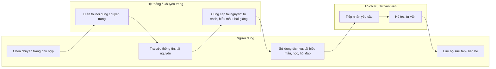

---

## 7. Hợp phần Diễn đàn

**Màn hình đại diện**

*Hình 7. Màn hình Diễn đàn chính sách pháp luật — Danh sách diễn đàn (`/dien-dan`), chi tiết chủ đề thảo luận (`/dien-dan/bai-viet/:id`) và sự kiện phát trực tuyến (`/dien-dan/su-kien`).*

### 7.1. Tên hợp phần
Hợp phần Diễn đàn chính sách pháp luật.

### 7.2. Mục tiêu của hợp phần
Tạo không gian trao đổi, thảo luận công khai giữa người dân, doanh nghiệp, chuyên gia và cơ quan nhà nước về các vấn đề chính sách, pháp luật; qua đó thúc đẩy phản biện xã hội, tạo đồng thuận và nâng cao chất lượng xây dựng, thi hành pháp luật.

### 7.3. Mô tả về hợp phần
Hợp phần cung cấp danh sách các diễn đàn theo nhiều cách sắp xếp: diễn đàn mới, diễn đàn nhiều người tham gia và toàn bộ diễn đàn theo lĩnh vực, có hỗ trợ tìm kiếm, lọc và sắp xếp. Người dùng có thể đăng ký tham gia một diễn đàn hoặc chủ đề quan tâm, tạo chủ đề thảo luận mới và gửi duyệt. Mỗi chủ đề có màn hình chi tiết hiển thị nội dung đầy đủ, tài liệu đính kèm, dòng thời gian, thẻ chủ đề cùng các chức năng theo dõi và chia sẻ. Trong phần thảo luận, người dùng gửi bình luận, góp ý theo từng đoạn nội dung, đính kèm tài liệu, bỏ phiếu cho ý kiến và báo cáo vi phạm. Hợp phần còn tổ chức các sự kiện phát trực tuyến cho phép người tham gia bình chọn ý kiến, câu hỏi theo thời gian thực, đồng thời cung cấp số liệu thống kê về hoạt động của diễn đàn.

### 7.4. Đối tượng sử dụng hướng đến
Người dân, doanh nghiệp, chuyên gia, nhà khoa học và các hiệp hội, tổ chức quan tâm đến chính sách, pháp luật; quản trị viên và ban biên tập thực hiện kiểm duyệt nội dung.

### 7.5. Điểm nổi bật của hợp phần
- Cho phép góp ý theo từng đoạn nội dung, bám sát vấn đề thảo luận.
- Hỗ trợ bỏ phiếu và bình chọn ý kiến để phản ánh mức độ đồng thuận.
- Tổ chức sự kiện phát trực tuyến có tương tác theo thời gian thực.
- Có cơ chế kiểm duyệt và báo cáo vi phạm, bảo đảm môi trường lành mạnh.
- Cung cấp thống kê hoạt động phục vụ theo dõi, đánh giá.

### 7.6. Luồng quy trình tổng quan
1. Người dùng duyệt danh sách diễn đàn, chủ đề và đăng ký tham gia chủ đề quan tâm.
2. Người dùng tạo chủ đề thảo luận mới và gửi duyệt (nếu muốn khởi xướng).
3. Quản trị viên hoặc ban biên tập kiểm duyệt chủ đề và nội dung.
4. Chủ đề đạt yêu cầu được đăng công khai trên diễn đàn.
5. Các thành viên thảo luận, góp ý, bỏ phiếu và báo cáo vi phạm (nếu có).
6. Người dùng theo dõi chủ đề và nhận thông báo phản hồi.

**Sơ đồ swimlane luồng quy trình:**

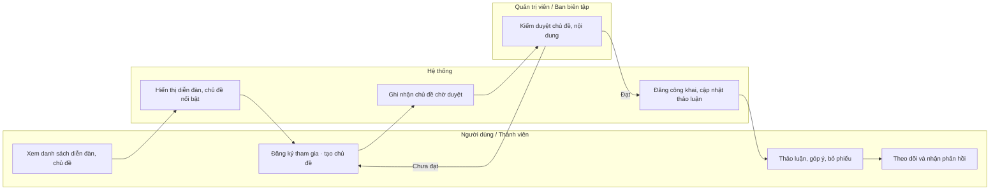

---

## PHỤ LỤC: DANH MỤC TỆP ẢNH MÀN HÌNH CẦN CHÈN

| Hợp phần | Tên tệp ảnh | Đường dẫn màn hình để chụp |
|---|---|---|
| Đa phương tiện | `images/man-hinh-da-phuong-tien.png` | `/video`, `/anh`, `/infographic` |
| Dự thảo văn bản | `images/man-hinh-du-thao.png` | `/du-thao` và `/du-thao/:id` |
| Quản lý thông tin cá nhân hóa | `images/man-hinh-ca-nhan-hoa.png` | `/ca-nhan/trang-chu` |
| Hỏi đáp và tư vấn pháp luật | `images/man-hinh-hoi-dap-tu-van.png` | `/cau-hoi-phap-luat` và `/cau-hoi-phap-luat/chuyen-gia` |
| Hiến kế | `images/man-hinh-hien-ke.png` | `/hien-ke` và `/hien-ke/quy-trinh` |
| Các chuyên trang hỗ trợ pháp luật | `images/man-hinh-ho-tro-phap-luat.png` | `/tro-giup-phap-ly`, `/pho-bien-giao-duc`, `/ho-tro-phap-ly-doanh-nghiep` |
| Diễn đàn | `images/man-hinh-dien-dan.png` | `/dien-dan`, `/dien-dan/bai-viet/:id`, `/dien-dan/su-kien` |
